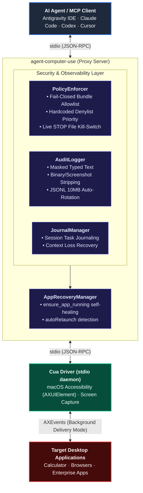

<div align="center">

# 🖥️ /agent-computer-use

**Enterprise-grade Safety, Policy Enforcement, and Crash Recovery Middleware for Desktop AI Agents on macOS**

[](LICENSE)
[]()
[]()
[]()
[](https://github.com/waniyaro/agent-computer-use/actions/workflows/ci.yml)

<br/>

[English](README.md) • [Русский](README.ru.md)

<br/>

</div>

**`agent-computer-use`** is an open-source, high-reliability [Model Context Protocol (MCP)](https://modelcontextprotocol.io) proxy server built on top of [Cua Driver](https://github.com/trycua/cua). 

While raw computer-use drivers provide the low-level capability to click and type, **`agent-computer-use` provides the missing enterprise safety layer**: strict per-application bundle ID access control, fail-closed enforcement, instant kill-switches, sanitized audit logging, crash recovery, and durable task journaling for autonomous agents.

---

## 🏛️ Architecture



---

## ✨ Key Features

| Capability | What It Does | Why It Matters |
| :--- | :--- | :--- |
| **🔒 Fail-Closed Security** | Blocks all GUI interactions unless an app is explicitly added to `allowedApps`. | Prevents rogue AI agents from wandering into arbitrary desktop windows. |
| **⛔ Protected App Denylist** | Hard-blocks password managers (1Password, Bitwarden, Keychain), System Settings, and Terminals. | Denylist takes absolute priority even if wildcards (`*`) are configured. |
| **🛑 Instant Kill-Switch** | Creates `~/.config/agent-computer-use/STOP` to immediately freeze all actions. | Halts runaway agents on the fly without needing to kill IDE processes. |
| **🤫 Private Audit Log** | Writes JSONL events with masked keystrokes (`logTypedText: false`) and stripped screenshots. | Full compliance and security audit trails without leaking secrets or filling disks. |
| **🔄 Self-Healing Recovery** | Custom `ensure_app_running` tool detects closed or crashed windows and restarts them. | Agents recover automatically without throwing raw OS errors or getting stuck. |
| **📝 Durable Task Journal** | Persistent JSONL journal (`task_journal_*`) per session. | Survives agent memory loss, context compaction, and IDE restarts. |
| **⚡ Minimal Tool Profile** | Downsamples Cua Driver's 58 tools into 16 focused, reliable primitives. | Keeps agent prompt context small, prevents tool confusion, and improves LLM reasoning. |

---

## 🚀 Quick Start

### 1. Prerequisites
- **OS:** macOS 13+ (Sonoma, Sequoia, or newer; Apple Silicon & Intel).
- **Node.js:** v20+ (v22 LTS recommended).
- **Cua Driver:** Installed via the official one-liner:
  ```bash
  /bin/bash -c "$(curl -fsSL https://cua.ai/driver/install.sh)"
  ```

### 2. Installation
```bash
git clone https://github.com/waniyaro/agent-computer-use.git
cd agent-computer-use
npm install
npm run build
```

### 3. Run System Diagnostics (`acu doctor`)
```bash
node dist/bin/acu.js doctor
```

The doctor verifies macOS version, Cua Driver binary, Accessibility & Screen Recording permissions, policy schema validity, and client integrations:
```text
======================================================
           agent-computer-use Doctor Report           
======================================================
--- 1. macOS Environment ---
  [OK]   Operating System: macOS 26.6.2 (arm64)
--- 2. Cua Driver ---
  [OK]   Binary executable: ~/.local/bin/cua-driver (cua-driver 0.34.0)
--- 3. macOS Permissions ---
  [OK]   TCC Grants: Accessibility: granted, Screen Recording: granted
--- 4. Policy Configuration ---
  [OK]   policy.json validation: Valid (toolProfile='minimal', allowedApps=1)
--- 5. Kill-Switch Status ---
  [OK]   Emergency STOP file: Inactive (normal operation)
--- 6. Client Integrations ---
  [OK]   Antigravity IDE: Configured in ~/.gemini/config/mcp_config.json
  [OK]   Claude Code: Configured in ~/.claude.json
------------------------------------------------------
Overall Status: [OK]
======================================================
```

### 4. Connect to Your MCP Client (`acu install`)

Install into your AI IDE with safe dry-run preview and automatic timestamped backups:

```bash
# Preview configuration (safe dry-run)
node dist/bin/acu.js install --client antigravity --dry-run

# Write configuration (creates .bak copy and preserves all other MCP servers)
node dist/bin/acu.js install --client antigravity --write
```

Supported clients:
- `antigravity` (Google Antigravity IDE)
- `claude-code` (Anthropic Claude Code CLI)
- `codex` (Codex CLI)

---

## 🛡️ Policy Configuration (`policy.json`)

Location: `~/.config/agent-computer-use/policy.json`

```json
{
  "allowedApps": [
    "com.apple.calculator"
  ],
  "deniedApps": [
    "com.1password.1password",
    "com.agilebits.onepassword7",
    "com.bitwarden.desktop",
    "com.apple.keychainaccess",
    "com.apple.systempreferences",
    "com.apple.Terminal",
    "com.googlecode.iterm2",
    "1Password",
    "Bitwarden",
    "Keychain",
    "System Settings",
    "Terminal",
    "iTerm"
  ],
  "maxActionsPerSession": 200,
  "toolProfile": "minimal",
  "allowForeground": false,
  "logTypedText": false,
  "autoRelaunch": false
}
```

### Configuration Reference

| Option | Type | Default | Description |
| :--- | :--- | :--- | :--- |
| `allowedApps` | `string[]` | `[]` | Whitelist of application bundle IDs or names. When empty, **all** action tools are blocked (Fail-Closed). |
| `deniedApps` | `string[]` | `[...]` | Blacklist of sensitive apps. Always evaluated before `allowedApps`. |
| `maxActionsPerSession`| `number` | `200` | Safety cap preventing infinite loops or hallucinated repetitive clicks. |
| `toolProfile` | `"minimal" \| "full"` | `"minimal"` | `"minimal"` exposes 16 essential tools; `"full"` exposes all 58 backend tools. |
| `allowForeground` | `boolean` | `false` | When `false`, blocks `delivery_mode: "foreground"` to prevent focus stealing. |
| `logTypedText` | `boolean` | `false` | When `false`, masks input text in audit logs to protect credentials. |
| `autoRelaunch` | `boolean` | `false` | Automatically restarts the target application when a crash is detected. |

### Emergency Kill-Switch
To instantly freeze all actions without restarting your IDE:
```bash
touch ~/.config/agent-computer-use/STOP
```
To resume:
```bash
rm ~/.config/agent-computer-use/STOP
```

---

## 🛠️ Custom Proxy Tools

In addition to proxying Cua Driver primitives (`click`, `type_text`, `scroll`, `get_window_state`), `agent-computer-use` introduces 4 high-level reliability tools:

### `ensure_app_running`
Verifies whether an application process and window exist. If closed or crashed, launches it in the background, waits for window initialization, and updates process caches.
```json
{
  "bundle_id": "com.apple.calculator",
  "timeout_ms": 5000
}
```

### `task_journal_append`
Appends a milestone, observation, or status update to the session's JSONL journal (`~/.config/agent-computer-use/journal/<task_id>.jsonl`).
```json
{
  "note": "Calculated 17 * 23 = 391",
  "status": "completed"
}
```

### `task_journal_read`
Reads past checkpoints so an agent can resume trajectories after compaction or restart.
```json
{
  "task_id": "session-20261007-152252-87a2df"
}
```

### `task_journal_list`
Lists all historical and active task journals with summary statistics.

---

## 🧪 Testing

The test suite runs with Vitest and validates proxy resilience, policy enforcement, audit sanitization, and CLI commands:

```bash
npm test
```

```text
 ✓ tests/cli.test.ts (9 tests)
 ✓ tests/policy.test.ts (6 tests)
 ✓ tests/proxy.test.ts (4 tests)
 ✓ tests/recovery.test.ts (4 tests)

 Test Files  4 passed (4)
      Tests  23 passed (23)
```

---

## 🤝 Contributing

Contributions are warmly welcome! Please review [CONTRIBUTING.md](CONTRIBUTING.md) and [SECURITY.md](SECURITY.md) before opening a pull request.

---

## 📄 License

This project is licensed under the [MIT License](LICENSE).  
Underlying desktop automation powered by [Cua Driver](https://github.com/trycua/cua) (MIT License).
