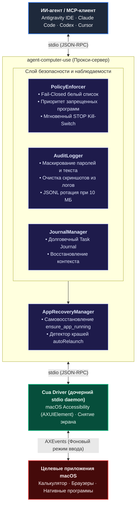

<div align="center">

# 🖥️ /agent-computer-use

**Надёжный слой безопасности, политик доступа и восстановления после сбоев для ИИ-агентов на macOS**

[](LICENSE)
[]()
[]()
[]()
[](https://github.com/waniyaro/agent-computer-use/actions/workflows/ci.yml)

<br/>

[English](README.md) • [Русский](README.ru.md)

<br/>

</div>

**`agent-computer-use`** — это открытый MCP-сервер (Model Context Protocol), функционирующий в качестве прокси и слоя безопасности поверх [Cua Driver](https://github.com/trycua/cua).

В то время как низкоуровневые драйверы управления рабочим столом умеют лишь механически нажимать на кнопки и вводить текст, **`agent-computer-use` предоставляет критически важный слой корпоративной безопасности**: строгий контроль приложений по macOS Bundle ID, принцип Fail-Closed, мгновенный файловый Kill-Switch, очищенный от паролей аудит-лог, самовосстановление при падении приложений и долговечный журнал задач для автономных агентов.

---

## 🏛️ Архитектура



---

## ✨ Ключевые возможности

| Возможность | Что делает | Почему это важно |
| :--- | :--- | :--- |
| **🔒 Безопасность Fail-Closed** | Блокирует любые действия с окнами, если приложение явно не добавлено в `allowedApps`. | Защищает от неконтролируемых кликов агента в чужих окнах. |
| **⛔ Защита критических программ** | Всегда блокирует менеджеры паролей (1Password, Bitwarden, Keychain), настройки macOS и Терминал. | Запрещенный список (`deniedApps`) имеет абсолютный приоритет даже при маске `*`. |
| **🛑 Мгновенный Kill-Switch** | Создание файла `~/.config/agent-computer-use/STOP` моментально замораживает действия. | Позволяет экстренно остановить агента без убийства процессов IDE. |
| **🤫 Конфиденциальный аудит** | Пишет JSONL-события с маскированием ввода (`logTypedText: false`) и удалением картинок. | Полный аудит действий без риска утечки паролей или забивания диска скриншотами. |
| **🔄 Самовосстановление окон** | Инструмент `ensure_app_running` определяет закрытие или падение окна и перезапускает его. | Агент восстанавливает работу без краша контекста и застревания. |
| **📝 Журнал задачи (Task Journal)** | Долговечный файл задач (`task_journal_*`) для каждой сессии. | Позволяет продолжить цепочку действий после очистки контекста или перезапуска IDE. |
| **⚡ Минимальный профиль тулов** | Фильтрует 58 инструментов Cua Driver до 16 самых надежных и необходимых. | Экономит токены в контексте LLM, защищает от галлюцинаций и путаницы в тулах. |

---

## 🚀 Быстрый старт

### 1. Системные требования
- **ОС:** macOS 13+ (Ventura, Sonoma, Sequoia или новее; Apple Silicon и Intel).
- **Node.js:** v20+ (рекомендуется v22 LTS).
- **Cua Driver:** Устанавливается официальной командой:
  ```bash
  /bin/bash -c "$(curl -fsSL https://cua.ai/driver/install.sh)"
  ```

### 2. Установка
```bash
git clone https://github.com/waniyaro/agent-computer-use.git
cd agent-computer-use
npm install
npm run build
```

### 3. Диагностика окружения (`acu doctor`)
```bash
node dist/bin/acu.js doctor
```

Команда `doctor` автоматически проверяет версию macOS, бинарник Cua Driver, права Accessibility и Screen Recording, схему политик и файлы клиентов:
```text
======================================================
           agent-computer-use Doctor Report           
======================================================
--- 1. macOS Environment ---
  [OK]   Operating System: macOS 26.6.2 (arm64)
--- 2. Cua Driver ---
  [OK]   Binary executable: ~/.local/bin/cua-driver (cua-driver 0.34.0)
--- 3. macOS Permissions ---
  [OK]   TCC Grants: Accessibility: granted, Screen Recording: granted
--- 4. Policy Configuration ---
  [OK]   policy.json validation: Valid (toolProfile='minimal', allowedApps=1)
--- 5. Kill-Switch Status ---
  [OK]   Emergency STOP file: Inactive (normal operation)
--- 6. Client Integrations ---
  [OK]   Antigravity IDE: Configured in ~/.gemini/config/mcp_config.json
  [OK]   Claude Code: Configured in ~/.claude.json
------------------------------------------------------
Overall Status: [OK]
======================================================
```

### 4. Подключение к MCP-клиенту (`acu install`)

Безопасная установка с предварительным просмотром (`--dry-run`) и созданием резервной копии (`.bak`):

```bash
# Предварительный просмотр (без записи на диск)
node dist/bin/acu.js install --client antigravity --dry-run

# Запись с сохранением чужих серверов и бэкапом
node dist/bin/acu.js install --client antigravity --write
```

Поддерживаемые клиенты:
- `antigravity` (Google Antigravity IDE)
- `claude-code` (Anthropic Claude Code CLI)
- `codex` (Codex CLI)

---

## 🛡️ Конфигурация безопасности (`policy.json`)

Путь к файлу: `~/.config/agent-computer-use/policy.json`

```json
{
  "allowedApps": [
    "com.apple.calculator"
  ],
  "deniedApps": [
    "com.1password.1password",
    "com.agilebits.onepassword7",
    "com.bitwarden.desktop",
    "com.apple.keychainaccess",
    "com.apple.systempreferences",
    "com.apple.Terminal",
    "com.googlecode.iterm2",
    "1Password",
    "Bitwarden",
    "Keychain",
    "System Settings",
    "Terminal",
    "iTerm"
  ],
  "maxActionsPerSession": 200,
  "toolProfile": "minimal",
  "allowForeground": false,
  "logTypedText": false,
  "autoRelaunch": false
}
```

### Описание параметров

| Параметр | Тип | По умолчанию | Описание |
| :--- | :--- | :--- | :--- |
| `allowedApps` | `string[]` | `[]` | Белый список Bundle ID или имен приложений. Если пуст — действия заблокированы (**Fail-Closed**). |
| `deniedApps` | `string[]` | `[...]` | Черный список критических приложений. Всегда проверяется до `allowedApps`. |
| `maxActionsPerSession`| `number` | `200` | Лимит действий за сессию (защита от зацикливания агента). |
| `toolProfile` | `"minimal" \| "full"` | `"minimal"` | `"minimal"` отдает 16 основных тулов; `"full"` отдает все 58 инструментов Cua Driver. |
| `allowForeground` | `boolean` | `false` | При `false` запрещает режим `delivery_mode: foreground` (окна не крадут фокус). |
| `logTypedText` | `boolean` | `false` | При `false` скрывает введенный текст в `audit.log` для защиты паролей. |
| `autoRelaunch` | `boolean` | `false` | Автоматически перезапускает приложение при неожиданном краше. |

### Аварийный выключатель (Kill-Switch)
Чтобы экстренно заблокировать все действия агента без перезапуска IDE:
```bash
touch ~/.config/agent-computer-use/STOP
```
Чтобы возобновить работу:
```bash
rm ~/.config/agent-computer-use/STOP
```

---

## 🛠️ Собственные инструменты прокси

В дополнение к базовым инструментам Cua Driver (`click`, `type_text`, `scroll`, `get_window_state`), прокси предоставляет 4 инструмента надежности:

### `ensure_app_running`
Проверяет наличие активного окна приложения. Если процесс закрыт или упал, запускает его в фоне, дожидается инициализации окна и обновляет кэш процесса.
```json
{
  "bundle_id": "com.apple.calculator",
  "timeout_ms": 5000
}
```

### `task_journal_append`
Записывает промежуточный шаг, решение или статус в файл задачи (`~/.config/agent-computer-use/journal/<task_id>.jsonl`).
```json
{
  "note": "Посчитан результат 17 * 23 = 391",
  "status": "completed"
}
```

### `task_journal_read`
Считывает историю шагов, чтобы агент мог восстановить контекст после сжатия памяти или рестарта.
```json
{
  "task_id": "session-20261007-152252-87a2df"
}
```

### `task_journal_list`
Возвращает список всех сохраненных журналов задач с количеством шагов и статусом.

---

## 🧪 Тестирование

Набор тестов на Vitest проверяет устойчивость к падениям бэкенда, политики доступа, санитаризацию аудита и работу CLI:

```bash
npm test
```

```text
 ✓ tests/cli.test.ts (9 tests)
 ✓ tests/policy.test.ts (6 tests)
 ✓ tests/proxy.test.ts (4 tests)
 ✓ tests/recovery.test.ts (4 tests)

 Test Files  4 passed (4)
      Tests  23 passed (23)
```

---

## 🤝 Участие в разработке

Мы рады контрибьюторам! Ознакомьтесь с [CONTRIBUTING.md](CONTRIBUTING.md) и [SECURITY.md](SECURITY.md) перед созданием Pull Request.

---

## 📄 Лицензия

Проект распространяется под лицензией [MIT](LICENSE).  
Драйвер автоматизации: [Cua Driver](https://github.com/trycua/cua) (лицензия MIT).
