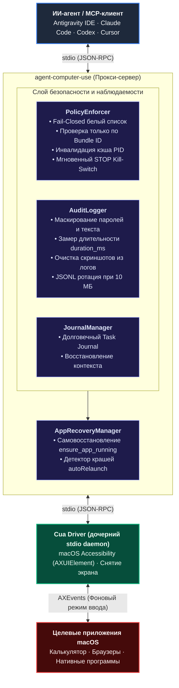

<div align="center">

# 🖥️ /agent-computer-use

**Экспериментальный слой безопасности, политик доступа и восстановления после сбоев для ИИ-агентов на macOS**

[](LICENSE)
[]()
[]()
[]()
[](https://github.com/waniyaro/agent-computer-use/actions/workflows/ci.yml)

<br/>

[English](README.md) • [Русский](README.ru.md)

<br/>

</div>

**`agent-computer-use`** — это открытый, экспериментальный MCP-сервер (Model Context Protocol), функционирующий в качестве прокси и слоя безопасности поверх [Cua Driver](https://github.com/trycua/cua).

В то время как низкоуровневые драйверы управления рабочим столом умеют лишь механически нажимать на кнопки и вводить текст, **`agent-computer-use` предоставляет специализированный слой безопасности и надежности**: строгий контроль приложений по macOS Bundle ID, принцип Fail-Closed, мгновенный файловый Kill-Switch, очищенный от паролей аудит-лог с замером времени выполнения (`duration_ms`), инвалидацию устаревшего кэша PID, самовосстановление при падении приложений и долговечный журнал задач для автономных агентов.

---

## 🏛️ Архитектура



---

## ✨ Ключевые возможности

| Возможность | Что делает | Почему это важно |
| :--- | :--- | :--- |
| **🔒 Безопасность Fail-Closed** | Блокирует любые действия с окнами, если Bundle ID приложения явно не добавлен в `allowedApps`. | Защищает от неконтролируемых кликов агента в чужих окнах. |
| **⛔ Защита критических программ** | Всегда блокирует менеджеры паролей (1Password, Bitwarden, Keychain), настройки macOS и Терминал по bundle ID. | Запрещенный список (`deniedApps`) имеет приоритет. Подделка имени приложения (spoofing) исключена. |
| **🛑 Мгновенный Kill-Switch** | Создание файла `~/.config/agent-computer-use/STOP` моментально замораживает действия. | Позволяет экстренно остановить агента без убийства процессов IDE. |
| **🤫 Конфиденциальный аудит** | Пишет JSONL-события с замером задержки, маскированием ввода (`logTypedText: false`) и удалением картинок. | Полный аудит действий без риска утечки паролей или забивания диска скриншотами. |
| **🔄 Самовосстановление окон** | Инструмент `ensure_app_running` определяет закрытие или падение окна и перезапускает его, очищая устаревший кэш PID. | Агент восстанавливает работу без краша контекста и застревания. |
| **📝 Журнал задачи (Task Journal)** | Долговечный файл задач (`task_journal_*`) для каждой сессии с поддержкой пагинации (`limit`). | Позволяет продолжить цепочку действий после очистки контекста или перезапуска IDE. |
| **⚡ Минимальный профиль тулов** | Фильтрует 58 инструментов Cua Driver до 16 самых надежных и необходимых. | Экономит токены в контексте LLM, защищает от галлюцинаций и путаницы в тулах. |

---

## 🚀 Быстрый старт

### 1. Системные требования
- **ОС:** macOS 14+ (Sonoma, Sequoia или новее; Apple Silicon и Intel) согласно требованиям Cua Driver.
- **Node.js:** v20+ (рекомендуется v22 LTS).
- **Cua Driver:** Устанавливается согласно [официальной инструкции Cua Driver](https://github.com/trycua/cua). (Рекомендуется предварительно проверять установочные скрипты).

### 2. Установка
```bash
git clone https://github.com/waniyaro/agent-computer-use.git
cd agent-computer-use
npm install
npm run build
```

### 3. Диагностика системы (`acu doctor`)
```bash
node dist/bin/acu.js doctor
```

Диагностика проверяет версию macOS, бинарник Cua Driver, права TCC (Accessibility и Screen Recording), валидность конфига и клиентов:
```text
======================================================
           agent-computer-use Doctor Report           
======================================================
--- 1. macOS Environment ---
  [OK]   Operating System: macOS 26.6.2 (arm64)
--- 2. Cua Driver ---
  [OK]   Binary executable: ~/.local/bin/cua-driver (cua-driver 0.34.0)
--- 3. macOS Permissions ---
  [OK]   TCC Grants: Accessibility: granted, Screen Recording: granted
--- 4. Policy Configuration ---
  [OK]   policy.json validation: Valid (toolProfile='minimal', allowedApps=1)
--- 5. Kill-Switch Status ---
  [OK]   Emergency STOP file: Inactive (normal operation)
--- 6. Client Integrations ---
  [OK]   Antigravity IDE: Configured in ~/.gemini/config/mcp_config.json
  [OK]   Claude Code: Configured in ~/.claude.json
  [OK]   Codex: Not installed (optional)
------------------------------------------------------
Overall Status: [OK]
======================================================
```

### 4. Подключение к MCP-клиенту (`acu install`)

Установка с предварительным просмотром (dry-run) и созданием резервной копии:

```bash
# Предварительный просмотр (безопасный dry-run)
node dist/bin/acu.js install --client antigravity --dry-run

# Запись конфигурации (создает копию .bak и сохраняет все остальные MCP-серверы)
node dist/bin/acu.js install --client antigravity --write
```

Поддерживаемые клиенты:
- `antigravity` (Google Antigravity IDE)
- `claude-code` (Anthropic Claude Code CLI)
- `codex` (Codex CLI)

---

## 🛡️ Конфигурация политик (`policy.json`)

Путь: `~/.config/agent-computer-use/policy.json`

```json
{
  "allowedApps": [
    "com.apple.calculator"
  ],
  "deniedApps": [
    "com.1password.1password",
    "com.agilebits.onepassword7",
    "com.bitwarden.desktop",
    "com.apple.keychainaccess",
    "com.apple.systempreferences",
    "com.apple.Terminal",
    "com.googlecode.iterm2"
  ],
  "maxActionsPerSession": 200,
  "toolProfile": "minimal",
  "allowForeground": false,
  "logTypedText": false,
  "autoRelaunch": false,
  "allowAnyApp": false
}
```

### Описание параметров

| Параметр | Тип | По умолчанию | Описание |
| :--- | :--- | :--- | :--- |
| `allowedApps` | `string[]` | `[]` | Белый список Bundle ID (например, `"com.apple.calculator"`). Если список пуст, **все** действия блокируются (Fail-Closed). Wildcards не поддерживаются для предотвращения обхода. |
| `deniedApps` | `string[]` | `[...]` | Черный список критических приложений по Bundle ID. Всегда проверяется до `allowedApps`. |
| `maxActionsPerSession`| `number` | `200` | Лимит действий на сессию, предотвращающий зацикливание агента. |
| `toolProfile` | `"minimal" \| "full"` | `"minimal"` | `"minimal"` отдает 16 базовых тулов; `"full"` открывает все 58 инструментов Cua Driver. |
| `allowForeground` | `boolean` | `false` | При `false` запрещает `delivery_mode: "foreground"`, предотвращая перехват фокуса экрана у пользователя. |
| `logTypedText` | `boolean` | `false` | При `false` маскирует вводимый текст в аудит-логе. |
| `autoRelaunch` | `boolean` | `false` | Автоматически перезапускает приложение при сбое. |
| `allowAnyApp` | `boolean` | `false` | Отключает фильтрацию по белому списку (не рекомендуется). Черный список по-прежнему соблюдается. |

> [!IMPORTANT]
> **Граница безопасности GUI и хост-окружение агента:**  
> Список `deniedApps` и Policy Enforcer строго контролируют **исключительно действия GUI-автоматизации через данный MCP-прокси**. Они не позволяют агенту просматривать, кликать или вводить текст в защищенные графические окна macOS (такие как «Пароли», Связка ключей, Системные настройки, Редактор скриптов, Terminal.app или iTerm2).  
> **Данный прокси НЕ изолирует хост-окружение агента и другие инструменты IDE.** Если у агента в IDE (например, в Antigravity, Claude Code, Cursor) есть доступ к консольным инструментам (`run_command`, `bash`, терминал), он исполняет команды напрямую в операционной системе в обход прокси. Блокировка `com.apple.Terminal` в `deniedApps` предотвращает манипуляции с окном Терминала через GUI-клики, но не является песочницей для фоновых shell-команд самого агента.

#### Приложения в черном списке по умолчанию (`DEFAULT_DENIED_APPS`):
- `com.1password.1password` (1Password)
- `com.agilebits.onepassword7` (1Password 7)
- `com.bitwarden.desktop` (Bitwarden)
- `com.apple.keychainaccess` (Связка ключей)
- `com.apple.Passwords` (Системное приложение «Пароли» macOS)
- `com.apple.systempreferences` (Системные настройки macOS)
- `com.apple.Terminal` (Терминал macOS)
- `com.googlecode.iterm2` (iTerm2)
- `com.apple.ScriptEditor2` (Редактор скриптов / Script Editor)

### Аварийный выключатель (Kill-Switch)
Для мгновенной остановки всех действий агента без перезапуска IDE:
```bash
touch ~/.config/agent-computer-use/STOP
```
Для возобновления работы:
```bash
rm ~/.config/agent-computer-use/STOP
```

---

## 🛠️ Собственные инструменты прокси

В дополнение к базовым инструментам Cua Driver (`click`, `type_text`, `scroll`, `get_window_state`), `agent-computer-use` предоставляет 4 инструмента надежности:

### `ensure_app_running`
Проверяет наличие процесса и окна. Если окно закрыто или упало, запускает его в фоне, ждет инициализации и сбрасывает устаревший кэш процесса.
```json
{
  "bundle_id": "com.apple.calculator",
  "timeout_ms": 5000
}
```

### `task_journal_append`
Записывает веху, наблюдение или статус в JSONL-журнал сессии (`~/.config/agent-computer-use/journal/<task_id>.jsonl`).
```json
{
  "note": "Посчитан результат 17 * 23 = 391",
  "status": "completed"
}
```

### `task_journal_read`
Считывает контрольные точки (поддерживает `limit` и `task_id`; по умолчанию текущая сессия) для восстановления контекста агента.
```json
{
  "limit": 20
}
```

### `task_journal_list`
Выводит список всех активных и архивных журналов задач со сводной статистикой.

---

## 🧪 Тестирование

Тестовый набор Vitest проверяет устойчивость прокси, политики доступа, санитарную очистку аудита, журнал задач и CLI:

```bash
npm test
```

```text
 ✓ tests/audit.test.ts (5 tests)
 ✓ tests/cli.test.ts (9 tests)
 ✓ tests/journal.test.ts (5 tests)
 ✓ tests/policy.test.ts (10 tests)
 ✓ tests/proxy.test.ts (4 tests)
 ✓ tests/recovery.test.ts (4 tests)

 Test Files  6 passed (6)
      Tests  37 passed (37)
```

---

## 📄 Лицензия

Распространяется под лицензией [MIT](LICENSE).  
Драйвер автоматизации основан на [Cua Driver](https://github.com/trycua/cua) (MIT License).
